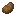
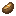
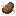

# Farming Addons [x_farming]

Extends Minetest default farming mod with new plants, crops and ice fishing using only minetest_game API (except couple of functions for e.g. block farming, ice fishing).

## Description

Hunger points in the description assume that you have [hbhubger](https://forum.minetest.net/viewtopic.php?t=11336) with hunger mod configured with x_farming. If not then you can consider hunger points as health points.

## Features

- adds food source to almost every biome, allows traveling the world without relying on apples only
- block farming, instead of food items, blocks can be harvested/crafted and used for building or decoration
- adds ice fishing - farming fish based on biomes and amount of ice around
- farming on different block than dirt, e.g. obsidian, jungle tree..
- farming in dark, no need for light for farming, e.g. obsidian wart
- vertical farming, e.g. farming cocoa on jungle tree trunk
- new trees and wood blocks allows for tree farms
- food items can heal or poison you
- some food items can be placed and used as decoration
- some food items can grow back on trees/cactus after harvesting
- using combination of snow block and pumpkin can spawn snowman mob
- mod is lightweight and optimized for servers
- plants and trees are spawning as decoration troughout the world (see biomes below)
- stairs and slabs for all new blocks
- leafdecay with falling fruit after tree trunk is harvested
- supports hbhunger mod
- crates and bags for storage (holds 1 stack)
- composter

### Composter

Right-click/place action with most plants, leaves, harvest, grass... will create/add compost. Once full another right-click/place action will give back bonemeal.
Each item has different chance for creating compost. In general items harder to obtain have higher chance of creating compost.
Additionally other mods can add group `{compost = 50}` to the items, where the number is chance of creating compost.

### Crates and Bags

Crafting crate/bag will give you empty crate/bag and can be used as a storage for raw farming items. Storage holds up to 1 stack making it work as "place-able" stacks. Crate/bag can be dug and carried while remembering the contents of the crate/bag. After placing the crate/bag you can access the contents again with right click (or the key by placing the node). List of items what can be placed in crates: melon, pumpkin_block, coffee, corn, obsidian_wart, potato, beetroot, carrot, cocoa_bean, kiwi_fruit, cactus_fruit_item, strawberry, pine_nut, stevia, soybean, fish, wheat, cotton. List of items what can be placed in bags: salt.

### Empty Soup Bowl 

Empty soup bowl is used as a vessel for soups and stew. To craft bowl put any kind of block with group wood in the middle of the bottom row in the crafting grid and then diagonal left and right also the same block, this will give you 3 empty soup bowls.

### Fish Stew 

Eating fish stew will restore 8 hunger points. To craft fish stew put empty soup bowl in the middle of the bottom row of the crafting grid, then bake potato above it, right from the potato will come salt, left from the potato will come carrot, then on top of the potato put any fish.

### Beetroot 

Beetroots are obtained from harvesting a fully grown crop plant, which drops the beetroot and seeds.
Beetroots can be eaten to restore 3 hunger points.

**Beetroot Soup** 

Beetroots soup can be eaten to restore 6 hunger points.
To craft beetroot soup put beetroot in the first two rows in the crafting grid and in the middle of the bottom row empty soup bowl.

### Carrot 

Carrot can be farmed and harvested on wet soil. Planted carrots take 8 stages to grow and go through 4 visually distinct stages.
Eating a carrot restores 3 hunger points.
Carrot can be used as an ingredient for hog stew.

**Golden Carrot** 

Eating golden carrot will restore 10 hunger points and 10 health points - the highest values currently in x_farming mod.
To craft golden carrot put regular carrot in the middle of the crafting grid and surround it with golden lumps.

### Coffee 

Planted coffee take 5 stages to grow. Farming coffee plants will drop coffee beans. Coffee beans cannot be eaten but are used to craft cup of coffee.

**Coffee Cup (hot)** 

Drinking/eating hot cup of coffee will restore 6 hunger points, 4 health points and will return a empty glass.
Hot cup of coffee can be obtained by cooking cold cup of coffee in a furnace.
Coffee cup can be placed as a block in the world for decoration.

### Corn 

When farmed, corn will take 10 stages to grow.
Corn cannot be eaten but is used for crafting popped corn.

**Popped Corn** 

Eating popped corn will restore 1 hunger point.
Popped corn can be obtained by cooking corn cobin a furnace.
Pooped corn can be furhter used for crafting popcorn.

**Popcorn** 

Eating popcorn will restore 5 hunger points.
Popcorn can be crafted by adding popped corn in the first row of the crafting grid and surround the rest of the grid with paper leaving the middle input empty.
Popcorn can be placed as a block in the world for decoration.

### Melon 

Farming melons will generate melon block in the last stage of growth. When harvesting this block and leaving the melon stem intact the melon block will grow from the stem again (in about 1 minetest day). The placement of the melon is completely random around the stem and it needs to have space 1 air in order to grow the melon block.
Melon fruit will drop melon slices.
Eeting melon slices will restore 2 health points.
Melon slices can be used for crafting melon block.

**Golden Melon** 

Eating golden melon slice will restore 10 hunger points and 10 health points - the highest values currently in x_farming mod.
To craft golden melon slice put melon slice in the middle of the crafting grid and surround it with golden lumps.

**Melon Block** 

Melon block cannot be eating nor crafted to seeds or melon slices.
Melon block can placed in to the world as a building block or for decoration.
To craft melon block fill the crafting grid with melon slices.

### Obsidian Wart 

When planted on plowed and wet obsidian soil, obsidian wart will grow through 6 stages. The growth rate is not affected by light or any other environmental factors.
Harvesting obsidian wart plant will drop obsidian wart what can be used for further crafting (see below).

**Wart Brick** 

Wart brick can be obtained by cooking obsidian wart in a furnace.
Wart brick is used for furhter crafting.

**Wart Block** 

Wart block is used as a building block and for decoration.
To craft wart block fill the crafting grid with obsidian wart.

**Wart Brick Block** 

Wart brick block is used as a building block and for decoration.
To craft wart brick block put wart brick next to wart brick to the first row of crafting grid and wart brick next to wart brick to the second row.

**Wart Red Brick Block** 

Wart red brick block is used as a building block and for decoration.
To craft wart red brick block put obsidian wart and wart brick to the first row of crafting grid and wart brick and obsidian wart to the second row.

**Wartrack** 

Wartrack is used as a building block and for decoration.
To craft wartrack put two wart blocks next to each other in first and second row of the crafting grid. This will return 4 wartracks.

All wart blocks includes slabs and stairs.

### Potato 

When farmed, potatoes will take 8 stages to grow. However, there are only 4 distinct textures, so only 4 visible stages.
Fully grown potato crops have chance of dropping an additional poisonous potato.
Eating a potato restores 2 hunger points.

**Baked potato** 

Baked potato can be obtained by cooking potato in a furnace.
Eating a baked potato restores 6 hunger points.
Baked potato can be used as an ingredient for hog stew.

**Poisonous potato** 

The poisonous potato is a rare drop when harvesting potato crops.
Eating a poisonous potato reduces 6 hunger points and 5 health points.
Poisonous potato cannot be planted on soil or baked.

### Pumpkin 

Farming pumpkin will generate pumpkin block in the last stage of growth. When harvesting this block and leaving the pumpkin stem intact the pumpkin block will grow from the stem again (in about 1 minetest day). The placement of the pumpkin is completely random around the stem and it needs to have space 1 air in order to grow the pumpkin block.
Pumpkin fruit/block will drop pumpking block.
Pumpking block can be used for crafting pumpkin pie, pumpkin lantern or can be used as a fuel (better than cactus).

**Pumpkin lantern** 

Pumpkin lantern gives the same light as torch but it's not flowed away by water.
To craft pumpkin lantern place torch in the middle of the crafting grid and put pumpkin block above it.
Pumpking lantern can be used as a fuel (better than cactus).

**Pumpkin pie** 

Eating pumpkin pie will restore 6 healt points.
To craft pumpkin pie put pumpkin block in the second row of the crafting grid, then flour next to it and egg below the flower.
Egg is currently dependent on [mobs redo](https://github.com/tenplus1/mobs_redo) mod.

**Snow golem** 

When [mobs npc installed with snow golem mob](https://bitbucket.org/minetest_gamers/mobs_npc/overview), placing 2 snowblocks vertically ending up with pumpkin block or pumpkin lantern a snow golem NPC will spawn. This mob is not tamed. You can tame snow golem with bread, meat or diamond. Snow golem will follow you and help you fight mobs or can stay in place (right click). Giving snow golem a gold lump will drop random item.

### Cocoa

Cocoa is planted on jungletree using cocoa bean and fully grown cocoa will drop cocoa bean. From cocoa bean you can further craft eat items. Cocoa have 3 stages of growth.

### Kiwi Tree

Kiwi tree can be found in savana and drops kiwi fruit and sapling from leaves. This tree adds new tree trunk and wood planks also (including stairs and slabs). Kiwi fruit will grow back on the tree after harvested from the tree enabling farming Kiwis. Can be placed as a decoration.

### Large Cactus with Fruit

Cactus with Fruits can be found in desert. You will need axe to harvest the fruit. Fruit will grow back on cactus after harvested - enabling harvesting Dragon Fruits. Can be placed as a decoration. Seedling can be crafted for more farming and harvesting.

### Strawberry

Strawberries can be found in coniferous forest. They drop seeds and strawberries.

### Pine Nut Tree

Allows to harvest pine nuts. Roasted pine nuts can be eaten.

### Salt

Can be farmed as ingredient to craft other food recipes.

### Ice Fishing

Ice fish for getting various kinds of fish, treasures and junk. What type of fish you get depends on the biome where you'r fishing and how many ice blocks are directly around your fishing equipment (there has to be space above the ice and nothing can obstruct the ice otherwise it will not count). For planting you fishing equipment you need to first drill a hole in ice using Ice Auger. Ice fishing equipment can be crafted, occasionally dropped out from digging your ice fishing equipment and can also spawn in cold biomes.

## Biomes

**Grassland**

- Melon
- Carrot
- Soybean

**Coniferous Forest**

- Strawberry
- Pine Nut Tree

**Desert**

- Large Cactus with Fruit (dragon fruit)

**Savanna**

- Kiwi Tree
- Coffee
- Stevia

**Rainforest**

- Cocoa

**Underground**

- Obsidian Wart (below -1000)

**Sandstone desert**

- Corn
- Pumpkin

**Cold desert**

- Potato
- Beetroot

**Taiga**

- Pine Nut Tree

**Rainforest Swamp**

- Salt
- Swamp Darter
- Swamp Frog
- Sturgeon
- Sunfish
- Swordfish

**Savanna Shore**

- Salt
- Angelfish
- Lingcod
- Lukewarm Ocean Hermit Crab
- Magma Slimefish
- Manta Ray

**Icesheet Ocean**

- Angler
- Frozen Boneminnow
- Frozen Ocean Hermit Crab
- Paddlefish
- Pearl Isopod

**Taiga Ocean**

- Armored Catfish
- Gar
- Giant Moray
- Perch
- Piglish

**Desert Ocean**

- Arrow Squid
- Desert Frog
- Desert Sunfish
- Piranha
- Prismfish
- Pumpkinseed

**Tundra Ocean**

- Barracuda
- Flier
- Floral Faefish
- Flounder
- Fourhorn Sculpin

**Snowy Grassland Ocean**

- Grass Pickerel
- Guppy
- Hagfish
- Rainbowfish
- Red Snapper

**Coniferous Forest Ocean**

- Bream
- Redbreast Sunfish
- Rockfish
- Rohu
- Rosefish

**Grassland Ocean**

- Conger
- Sablefish
- Sardine
- Sawfish
- Skate
- Skullfin

**Savanna Ocean**

- Chorus Snail
- White Bullhead
- Whitefish
- Wolffish
- Woodskip

**Cold Desert Ocean**

- Chub
- Cold Ocean Hermit Crab
- Oscar
- Leerfish

**Sandstone Desert Ocean**

- Clam
- Skykoi
- Smallmouth Bass
- Sterlet

**Deciduous Forest Ocean**

- Crayfish
- Damselfish
- Danios
- Vampire Squid
- Walleye
- Warm Ocean Hermit Crab

**Rainforest Ocean**

- Burbot
- Koi
- Lamprey
- Largemouth Bass
- Lava Eel
- Leech

**Icesheet**

- Dwarf Caiman
- Eel
- Electric Eel
- Endray
- Tench

**Tundra Beach**

- Carp
- Catfish
- Catla
- Ocean Hermit Crab
- Octopus

**Deciduous Forest Shore**

- Congo Tiger Fish
- Convict Cichlid
- Minnow
- Mud Flounder
- Neon Tetra

Seeds can be found also in dungeon chests.

## Dependencies

- default
- farming

## Optional Dependencies

- hbhunger
- flowers
- mobs_animal
- mobs_npc
- stairs
- wool
- dye
- vessels (recipes, if not present then x_farming will load its own vessels needed for recipe)
- bucket (recipes)

## License:

### Code

GNU Lesser General Public License v2.1 or later (see included LICENSE file)

### Textures

**CC BY-SA 4.0, Pixel Perfection by XSSheep**, https://minecraft.curseforge.com/projects/pixel-perfection-freshly-updated

- x_farming_beetroot_1.png
- x_farming_beetroot_2.png
- x_farming_beetroot_3.png
- x_farming_beetroot_4.png
- x_farming_beetroot_5.png
- x_farming_beetroot_6.png
- x_farming_beetroot_7.png
- x_farming_beetroot_8.png
- x_farming_beetroot.png
- x_farming_beetroot_seed.png
- x_farming_beetroot_soup.png
- x_farming_bowl.png
- x_farming_carrot_1.png
- x_farming_carrot_2.png
- x_farming_carrot_3.png
- x_farming_carrot_4.png
- x_farming_carrot_5.png
- x_farming_carrot_6.png
- x_farming_carrot_7.png
- x_farming_carrot_8.png
- x_farming_carrot_golden.png
- x_farming_carrot.png
- x_farming_chicken_stew.png
- x_farming_pumpkin_fruit_side_off.png
- x_farming_pumpkin_fruit_side_on.png
- x_farming_pumpkin_fruit_side.png
- x_farming_pumpkin_fruit_top.png
- x_farming_pumpkin_pie.png
- x_farming_pumpkin.png
- x_farming_pumpkin_seed.png
- x_farming_melon_seed.png
- x_farming_melon_fruit_side.png
- x_farming_melon_fruit_top.png
- x_farming_melon.png
- x_farming_golden_melon.png
- x_farming_obsidian_wart_1.png
- x_farming_obsidian_wart_2.png
- x_farming_obsidian_wart_3.png
- x_farming_obsidian_wart_4.png
- x_farming_obsidian_wart_5.png
- x_farming_obsidian_wart_6.png
- x_farming_obsidian_wart.png
- x_farming_potato_1.png
- x_farming_potato_2.png
- x_farming_potato_3.png
- x_farming_potato_4.png
- x_farming_potato_5.png
- x_farming_potato_6.png
- x_farming_potato_7.png
- x_farming_potato_8.png
- x_farming_potato_baked.png
- x_farming_potato.png
- x_farming_potato_poisonous.png
- x_farming_wart_block.png
- x_farming_wart_brick_block.png
- x_farming_wart_brick.png
- x_farming_wartrack.png
- x_farming_wart_red_brick_block.png
- x_farming_cookie.png
- x_farming_cocoa_1.png
- x_farming_cocoa_2.png
- x_farming_cocoa_3.png
- x_farming_kiwi_tree.png
- x_farming_kiwi_tree_top.png
- x_farming_kiwi_tree_wood.png
- x_farming_jungle_tree.png (Chorus edit)
- x_farming_jungle_tree_top.png (Chorus edit)
- x_farming_jungle_wood.png (Chorus edit)
- x_farming_pine_nut_tree.png
- x_farming_pine_nut_tree_top.png
- x_farming_pine_nut_wood.png
- x_farming_sugar.png

**by Lillie/Athesiel**, https://archhive.gay

- x_farming_fish_albacore.png
- x_farming_fish_anchovy.png
- x_farming_fish_angelfish.png
- x_farming_fish_angler.png
- x_farming_fish_armored_catfish.png
- x_farming_fish_arrow_squid.png
- x_farming_fish_barracuda.png
- x_farming_fish_black_seashroom.png
- x_farming_fish_blobfish.png
- x_farming_fish_blue_seashroom.png
- x_farming_fish_bream.png
- x_farming_fish_brown_seashroom.png
- x_farming_fish_burbot.png
- x_farming_fish_carp.png
- x_farming_fish_catfish.png
- x_farming_fish_catla.png
- x_farming_fish_chorus_snail.png
- x_farming_fish_chub.png
- x_farming_fish_clam.png
- x_farming_fish_cold_ocean_hermit_crab.png
- x_farming_fish_conger.png
- x_farming_fish_congo_tiger_fish.png
- x_farming_fish_convict_cichlid.png
- x_farming_fish_crab.png
- x_farming_fish_crayfish.png
- x_farming_fish_cyan_seashroom.png
- x_farming_fish_damselfish.png
- x_farming_fish_danios.png
- x_farming_fish_desert_frog.png
- x_farming_fish_desert_sunfish.png
- x_farming_fish_diamond_angler.png
- x_farming_fish_dwarf_caiman.png
- x_farming_fish_eel.png
- x_farming_fish_electric_eel.png
- x_farming_fish_endray.png
- x_farming_fish_father_sun.png
- x_farming_fish_flier.png
- x_farming_fish_floral_faefish.png
- x_farming_fish_flounder.png
- x_farming_fish_fourhorn_sculpin.png
- x_farming_fish_frozen_boneminnow.png
- x_farming_fish_frozen_ocean_hermit_crab.png
- x_farming_fish_gar.png
- x_farming_fish_giant_moray.png
- x_farming_fish_goldeye.png
- x_farming_fish_goldfish.png
- x_farming_fish_grass_pickerel.png
- x_farming_fish_gray_seashroom.png
- x_farming_fish_green_seashroom.png
- x_farming_fish_guppy.png
- x_farming_fish_hagfish.png
- x_farming_fish_halibut.png
- x_farming_fish_herring.png
- x_farming_fish_illager_ghostfish.png
- x_farming_fish_ironfish.png
- x_farming_fish_jungle_frog.png
- x_farming_fish_koi.png
- x_farming_fish_lamprey.png
- x_farming_fish_largemouth_bass.png
- x_farming_fish_lava_eel.png
- x_farming_fish_leech.png
- x_farming_fish_leerfish.png
- x_farming_fish_light_gray_seashroom.png
- x_farming_fish_lime_seashroom.png
- x_farming_fish_lingcod.png
- x_farming_fish_lobster.png
- x_farming_fish_lukewarm_ocean_hermit_crab.png
- x_farming_fish_magenta_seashroom.png
- x_farming_fish_magma_slimefish.png
- x_farming_fish_manta_ray.png
- x_farming_fish_minnow.png
- x_farming_fish_mother_moon.png
- x_farming_fish_mud_flounder.png
- x_farming_fish_neon_tetra.png
- x_farming_fish_obster.png
- x_farming_fish_ocean_hermit_crab.png
- x_farming_fish_octopus.png
- x_farming_fish_orange_seashroom.png
- x_farming_fish_oscar.png
- x_farming_fish_paddlefish.png
- x_farming_fish_pearl_isopod.png
- x_farming_fish_pearlwog.png
- x_farming_fish_perch.png
- x_farming_fish_piglish.png
- x_farming_fish_pike.png
- x_farming_fish_pink_seashroom.png
- x_farming_fish_piranha.png
- x_farming_fish_prismfish.png
- x_farming_fish_pumpkinseed.png
- x_farming_fish_purple_seashroom.png
- x_farming_fish_rainbow_trout.png
- x_farming_fish_rainbowfish.png
- x_farming_fish_red_mullet.png
- x_farming_fish_red_seashroom.png
- x_farming_fish_red_snapper.png
- x_farming_fish_redbreast_sunfish.png
- x_farming_fish_rockfish.png
- x_farming_fish_rohu.png
- x_farming_fish_rosefish.png
- x_farming_fish_rusty_skullfin.png
- x_farming_fish_sablefish.png
- x_farming_fish_sardine.png
- x_farming_fish_sawfish.png
- x_farming_fish_sea_cucumber.png
- x_farming_fish_shrimp.png
- x_farming_fish_skate.png
- x_farming_fish_skullfin.png
- x_farming_fish_skykoi.png
- x_farming_fish_slimefish.png
- x_farming_fish_smallmouth_bass.png
- x_farming_fish_sterlet.png
- x_farming_fish_stingray.png
- x_farming_fish_sturgeon.png
- x_farming_fish_sunfish.png
- x_farming_fish_swamp_darter.png
- x_farming_fish_swamp_frog.png
- x_farming_fish_swordfish.png
- x_farming_fish_tancho_koi.png
- x_farming_fish_tench.png
- x_farming_fish_tilapia.png
- x_farming_fish_totemfish.png
- x_farming_fish_true_goldfish.png
- x_farming_fish_vampire_squid.png
- x_farming_fish_walleye.png
- x_farming_fish_warm_ocean_hermit_crab.png
- x_farming_fish_white_bullhead.png
- x_farming_fish_white_seashroom.png
- x_farming_fish_whitefish.png
- x_farming_fish_wolffish.png
- x_farming_fish_woodskip.png
- x_farming_fish_yellow_seashroom.png

**CC BY-SA 4.0, by SaKeL**

- x_farming_carrot_seed.png
- x_farming_potato_seed.png
- x_farming_coffee.png
- x_farming_coffee_seed.png
- x_farming_corn_popcorn.png
- x_farming_obsidian_soil.png
- x_farming_obsidian_soil_wet.png
- x_farming_obsidian_soil_wet_side.png
- x_farming_obsidian_wart_seed.png
- x_farming_corn_1.png
- x_farming_corn_2.png
- x_farming_corn_3.png
- x_farming_corn_4.png
- x_farming_corn_5.png
- x_farming_corn_6.png
- x_farming_corn_7.png
- x_farming_corn_8.png
- x_farming_corn_9.png
- x_farming_corn_10.png
- x_farming_corn_pop.png
- x_farming_corn_seed.png
- x_farming_kiwi.png
- x_farming_kiwi_fruit.png
- x_farming_kiwi_sapling.png
- x_farming_cactus_fruit_bottom.png
- x_farming_cactus_fruit_sides.png
- x_farming_cactus_fruit_top.png
- x_farming_cactus_fruit_item.png
- x_farming_large_cactus_with_fruit_seedling.png
- x_farming_large_cactus_with_fruit_seedling
- x_farming_strawberry_seed.png
- x_farming_strawberry.png
- x_farming_jungleleaves.png
- x_farming_pine_nut.png
- x_farming_pine_nut_roasted.png
- x_farming_coffee_cup_hot.png
- x_farming_bottle_coffee.png
- x_farming_bottle_water.png
- x_farming_bottle_soymilk_raw.png
- x_farming_bottle_soymilk.png
- x_farming_donut.png
- x_farming_donut_chocolate.png
- x_farming_soybean.png
- x_farming_soybean_1.png
- x_farming_soybean_2.png
- x_farming_soybean_3.png
- x_farming_soybean_4.png
- x_farming_soybean_5.png
- x_farming_soybean_6.png
- x_farming_soybean_7.png
- x_farming_soybean_seed.png
- x_farming_stevia.png
- x_farming_stevia_1.png
- x_farming_stevia_2.png
- x_farming_stevia_3.png
- x_farming_stevia_4.png
- x_farming_stevia_5.png
- x_farming_stevia_6.png
- x_farming_stevia_7.png
- x_farming_stevia_8.png
- x_farming_stevia_seed.png
- x_farming_x_bonemeal_bonemeal.png
- x_farming_salt_1_side.png
- x_farming_salt_1_top.png
- x_farming_salt_2_side.png
- x_farming_salt_2_top.png
- x_farming_salt_3_side.png
- x_farming_salt_3_top.png
- x_farming_salt_4_side.png
- x_farming_salt_4_top.png
- x_farming_salt_water.png
- x_farming_drilled_ice.png
- x_farming_ice_auger.png
- x_farming_icefishing_back_0.png
- x_farming_icefishing_back_1.png
- x_farming_icefishing_back_2.png
- x_farming_icefishing_back_3.png
- x_farming_icefishing_back_4.png
- x_farming_icefishing_back_5.png
- x_farming_icefishing_back_6.png
- x_farming_icefishing_back_7.png
- x_farming_icefishing_back_8.png
- x_farming_icefishing_back_9.png
- x_farming_icefishing_bottom.png
- x_farming_icefishing_front_0.png
- x_farming_icefishing_front_1.png
- x_farming_icefishing_front_2.png
- x_farming_icefishing_front_3.png
- x_farming_icefishing_front_4.png
- x_farming_icefishing_front_5.png
- x_farming_icefishing_front_6.png
- x_farming_icefishing_front_7.png
- x_farming_icefishing_front_8.png
- x_farming_icefishing_front_9.png
- x_farming_icefishing_inv.png
- x_farming_icefishing_left.png
- x_farming_icefishing_right.png
- x_farming_icefishing_top_1.png
- x_farming_icefishing_top_2.png
- x_farming_icefishing_top_3.png
- x_farming_icefishing_top_4.png
- x_farming_icefishing_top_5.png
- x_farming_icefishing_top_6.png
- x_farming_icefishing_top_7.png
- x_farming_icefishing_top_8.png
- x_farming_icefishing_top_9.png
- x_farming_icefishing_top_animated.png
- x_farming_icefishing_top_animated_9.png
- x_farming_hog_stew_mesh.png
- x_farming_beetroot_soup_mesh.png
- x_farming_pumpkin_pie_mesh.png
- x_farming_kiwi_fruit_mesh.png
- x_farming_corn_popcorn_mesh.png
- x_farming_fries_mesh.png
- x_farming_coffee_cup_hot_mesh.png
- x_farming_donut_mesh.png
- x_farming_donut_chocolate_mesh.png
- x_farming_bag_salt.png
- x_farming_crate_beetroot_3.png
- x_farming_crate_cactus_fruit_item_3.png
- x_farming_crate_carrot_3.png
- x_farming_crate_cocoa_bean_3.png
- x_farming_crate_coffee_3.png
- x_farming_crate_corn_3.png
- x_farming_crate_cotton_3.png
- x_farming_crate_fish_3.png
- x_farming_crate_kiwi_fruit_3.png
- x_farming_crate_melon_3.png
- x_farming_crate_obsidian_wart_3.png
- x_farming_crate_pine_nut_3.png
- x_farming_crate_potato_3.png
- x_farming_crate_pumpkin_block_3.png
- x_farming_crate_soybean_3.png
- x_farming_crate_stevia_3.png
- x_farming_crate_strawberry_3.png
- x_farming_crate_wheat_3.png
- x_farming_fly.png
- x_farming_composter_1.png
- x_farming_composter_4.png
- x_farming_composter_5.png
- x_farming_composter_2.png
- x_farming_composter_3.png
- x_farming_coffee_1.png
- x_farming_coffee_2.png
- x_farming_coffee_3.png
- x_farming_coffee_4.png
- x_farming_coffee_5.png
- x_farming_pumpkin_1.png
- x_farming_pumpkin_2.png
- x_farming_pumpkin_3.png
- x_farming_pumpkin_4.png
- x_farming_pumpkin_5.png
- x_farming_pumpkin_6.png
- x_farming_pumpkin_7.png
- x_farming_pumpkin_8.png
- x_farming_corn.png
- x_farming_chocolate.png
- x_farming_fries.png
- x_farming_bag_empty.png -- Derived from Farmer's Delight by vectorwing (MIT)
- x_farming_crate_empty.png -- Derived from Farmer's Delight by vectorwing (MIT)
- x_farming_melon_1.png -- Derived from texture Pixel Perfection by XSSheep (CC BY-SA 4.0)
- x_farming_melon_2.png -- Derived from texture Pixel Perfection by XSSheep (CC BY-SA 4.0)
- x_farming_melon_3.png -- Derived from texture Pixel Perfection by XSSheep (CC BY-SA 4.0)
- x_farming_melon_4.png -- Derived from texture Pixel Perfection by XSSheep (CC BY-SA 4.0)
- x_farming_melon_5.png -- Derived from texture Pixel Perfection by XSSheep (CC BY-SA 4.0)
- x_farming_melon_6.png -- Derived from texture Pixel Perfection by XSSheep (CC BY-SA 4.0)
- x_farming_melon_7.png -- Derived from texture Pixel Perfection by XSSheep (CC BY-SA 4.0)
- x_farming_melon_8.png -- Derived from texture Pixel Perfection by XSSheep (CC BY-SA 4.0)
- x_farming_strawberry_1.png -- Derived from texture Pixel Perfection by XSSheep (CC BY-SA 4.0)
- x_farming_strawberry_2.png -- Derived from texture Pixel Perfection by XSSheep (CC BY-SA 4.0)
- x_farming_strawberry_3.png -- Derived from texture Pixel Perfection by XSSheep (CC BY-SA 4.0)
- x_farming_strawberry_4.png -- Derived from texture Pixel Perfection by XSSheep (CC BY-SA 4.0)
- x_farming_pine_nut_leaves.png -- Derived from texture Pixel Perfection by XSSheep (CC BY-SA 4.0)
- x_farming_x_bonemeal_particles.png -- Derived from texture Pixel Perfection by XSSheep (CC BY-SA 4.0)
- x_farming_salt.png -- Derived from texture Pixel Perfection by XSSheep (CC BY-SA 4.0)
- x_farming_kiwi_leaves.png (MTG -- Derived from texture by paramat (CC BY-SA 3.0)
- x_farming_junglesapling.png -- Derived from texture by PilzAdam (CC BY-SA 3.0)
- x_farming_pine_nut_sapling.png -- Derived from texture by Splizard (CC BY-SA 3.0)
- x_farming_salt_1_bottom.png -- Derived from a texture by random-geek (CC BY-SA 3.0) -- Derived from texture by Neuromancer (CC BY-SA 3.0)

**CC BY-SA 3.0, modified by Thomas-S**

- x_farming_vessels_glass_bottle.png

### Sound

**CC BY 3.0, by MaxDemianAGL**, https://freesound.org

- x_farming_x_bonemeal_grow.ogg

**CC BY 3.0, by Angel_Perez_Grandi**, https://freesound.org

- x_farming_ice_dug.ogg (MTG)

### Models

**CC BY-SA 4.0, by SaKeL**

- x_farming_hog_stew.obj
- x_farming_beetroot_soup.obj
- x_farming_pumpkin_pie.obj
- x_farming_kiwi_fruit.obj
- x_farming_corn_popcorn.obj
- x_farming_fries.obj
- x_farming_coffee_cup_hot.obj
- x_farming_donut.obj
- x_farming_crate.obj
- x_farming_bag.obj

## Installation

see: https://wiki.minetest.net/Installing_Mods
