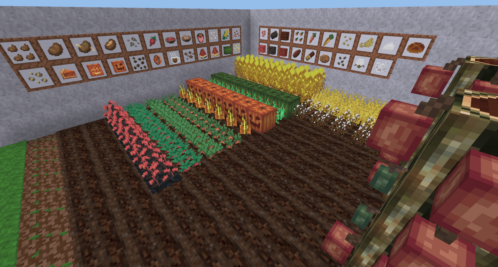

# Farming Addons [farming_addons]

Extends Minetest default farming mod with new plants and crops using only minetest_game API (except couple of functions for e.g. block farming).

## Description

Hunger points in the description assume that you have [hudbars](https://bitbucket.org/minetest_gamers/hudbars) with hunger mod configured with farming_addons. If not then you can consider hunger points as health points.

### Empty Soup Bowl 

Empty soup bowl is used as a vessel for soups and stew. To craft bowl put any kind of block with group wood in the middle of the bottom row in the crafting grid and then diagonal left and right also the same block, this will give you 3 empty soup bowls.

### Hog Stew 

Eating hog stew will restore 8 hunger points. To craft hog stew put empty soup bowl in the middle of the bottom row of the crafting grid, then bake potato above it, right from the potato will come mushroom (red or brown), left from the potato will come carrot, then on top of the potato put raw pork (mobs redo, pumba/warthog).

### Beetroot 

Beetroots are obtained from harvesting a fully grown crop plant, which drops the beetroot and seeds.
Beetroots can be eaten to restore 3 hunger points.

**Beetroot Soup** 

Beetroots soup can be eaten to restore 6 hunger points.
To craft beetroot soup put beetroot in the first two rows in the crafting grid and in the middle of the bottom row empty soup bowl.

### Carrot 

Carrot can be farmed and harvested on wet soil. Planted carrots take 8 stages to grow and go through 4 visually distinct stages.
Eating a carrot restores 3 hunger points.
Carrot can be used as an ingredient for hog stew.

**Golden Carrot** 

Eating golden carrot will restore 10 hunger points and 10 health points - the highest values currently in farming_addons mod.
To craft golden carrot put regular carrot in the middle of the crafting grid and surround it with golden lumps.

### Coffee 

Planted coffee take 5 stages to grow. Farming coffee plants will drop coffee beans. Coffee beans cannot be eaten but are used to craft cup of coffee.

**Coffee Cup (cold)** 

Drinking/eating cold cup of coffee will restore 4 hunger points and will return a empty glass.
Cold cup of coffee can be crafted by putting empty glass to the graft grid, next to it comes coffee bean and under it will come bucket of water. Empty bucket of water will be returned.

**Coffee Cup (hot)** 

Drinking/eating hot cup of coffee will restore 6 hunger points, 4 health points and will return a empty glass.
Hot cup of coffee can be obtained by cooking cold cup of coffee in a furnace.
Coffee cup can be placed as a block in the world for decoration.

### Corn 

When farmed, corn will take 10 stages to grow.
Corn cannot be eaten but is used for crafting popped corn.

**Popped Corn** 

Eating popped corn will restore 1 hunger point.
Popped corn can be obtained by cooking corn cobin a furnace.
Pooped corn can be furhter used for crafting popcorn.

**Popcorn** 

Eating popcorn will restore 5 hunger points.
Popcorn can be crafted by adding popped corn in the first row of the crafting grid and surround the rest of the grid with paper leaving the middle input empty.
Popcorn can be placed as a block in the world for decoration.

### Melon 

Farming melons will generate melon block in the last stage of growth. When harvesting this block and leaving the melon stem intact the melon block will grow from the stem again (in about 1 minetest day). The placement of the melon is completely random around the stem and it needs to have space 1 air in order to grow the melon block.
Melon fruit will drop melon slices.
Eeting melon slices will restore 2 health points.
Melon slices can be used for crafting melon block.

**Golden Melon** 

Eating golden melon slice will restore 10 hunger points and 10 health points - the highest values currently in farming_addons mod.
To craft golden melon slice put melon slice in the middle of the crafting grid and surround it with golden lumps.

**Melon Block** 

Melon block cannot be eating nor crafted to seeds or melon slices.
Melon block can placed in to the world as a building block or for decoration.
To craft melon block fill the crafting grid with melon slices.

### Obsidian Wart 

When planted on plowed and wet obsidian soil, obsidian wart will grow through 6 stages. The growth rate is not affected by light or any other environmental factors.
Harvesting obsidian wart plant will drop obsidian wart what can be used for further crafting (see below).

**Wart Brick** 

Wart brick can be obtained by cooking obsidian wart in a furnace.
Wart brick is used for furhter crafting.

**Wart Block** 

Wart block is used as a building block and for decoration.
To craft wart block fill the crafting grid with obsidian wart.

**Wart Brick Block** 

Wart brick block is used as a building block and for decoration.
To craft wart brick block put wart brick next to wart brick to the first row of crafting grid and wart brick next to wart brick to the second row.

**Wart Red Brick Block** 

Wart red brick block is used as a building block and for decoration.
To craft wart red brick block put obsidian wart and wart brick to the first row of crafting grid and wart brick and obsidian wart to the second row.

**Wartrack** 

Wartrack is used as a building block and for decoration.
To craft wartrack put two wart blocks next to each other in first and second row of the crafting grid. This will return 4 wartracks.

All wart blocks includes slabs and stairs.

### Potato 

When farmed, potatoes will take 8 stages to grow. However, there are only 4 distinct textures, so only 4 visible stages.
Fully grown potato crops have chance of dropping an additional poisonous potato.
Eating a potato restores 2 hunger points.

**Baked potato** 

Baked potato can be obtained by cooking potato in a furnace.
Eating a baked potato restores 6 hunger points.
Baked potato can be used as an ingredient for hog stew.

**Poisonous potato** 

The poisonous potato is a rare drop when harvesting potato crops.
Eating a poisonous potato reduces 6 hunger points and 5 health points.
Poisonous potato cannot be planted on soil or baked.

### Pumpkin 

Farming pumpkin will generate pumpkin block in the last stage of growth. When harvesting this block and leaving the pumpkin stem intact the pumpkin block will grow from the stem again (in about 1 minetest day). The placement of the pumpkin is completely random around the stem and it needs to have space 1 air in order to grow the pumpkin block.
Pumpkin fruit/block will drop pumpking block.
Pumpking block can be used for crafting pumpkin pie, pumpkin lantern or can be used as a fuel (better than cactus).

**Pumpkin lantern** 

Pumpkin lantern gives the same light as torch but it's not flowed away by water.
To craft pumpkin lantern place torch in the middle of the crafting grid and put pumpkin block above it.
Pumpking lantern can be used as a fuel (better than cactus).

**Pumpkin pie** 

Eating pumpkin pie will restore 6 healt points.
To craft pumpkin pie put pumpkin block in the second row of the crafting grid, then flour next to it and egg below the flower.
Egg is currently dependent on [mobs redo](https://github.com/tenplus1/mobs_redo) mod.

**Snow golem** 

When [mobs npc installed with snow golem mob](https://bitbucket.org/minetest_gamers/mobs_npc/overview), placing 2 snowblocks vertically ending up with pumpkin block or pumpkin lantern a snow golem NPC will spawn. This mob is not tamed. You can tame snow golem with bread, meat or diamond. Snow golem will follow you and help you fight mobs or can stay in place (right click). Giving snow golem a gold lump will drop random item.

## Seeds

**Obsidian Wart**

- red mushroom

**Beetroot and Pumpkin**

- dry grass

**Carrot**

- grass

**Potato**

- jungle grass

**Coffee**

- bush stem

**Corn and Melon**

- dry shrub

Getting seeds from decorations (grass..) can be changed/adjusted in the future when there is more decorations added to the default minetest game.

## Dependencies

- default
- farming
- flowers
- vessels

## License:

### Code

GNU Lesser General Public License v2.1 or later (see included LICENSE file)

### Textures

**Industrial Craft 2**, https://forum.industrial-craft.net/

- farming_addons_coffee_1.png
- farming_addons_coffee_2.png
- farming_addons_coffee_3.png
- farming_addons_coffee_4.png
- farming_addons_coffee_5.png
- farming_addons_pumpkin_1.png
- farming_addons_pumpkin_2.png
- farming_addons_pumpkin_3.png
- farming_addons_pumpkin_4.png
- farming_addons_pumpkin_5.png
- farming_addons_pumpkin_6.png
- farming_addons_pumpkin_7.png
- farming_addons_pumpkin_8.png

**CC BY-SA 4.0, Pixel Perfection by XSSheep**, https://minecraft.curseforge.com/projects/pixel-perfection-freshly-updated

- farming_addons_beetroot_1.png
- farming_addons_beetroot_2.png
- farming_addons_beetroot_3.png
- farming_addons_beetroot_4.png
- farming_addons_beetroot_5.png
- farming_addons_beetroot_6.png
- farming_addons_beetroot_7.png
- farming_addons_beetroot_8.png
- farming_addons_beetroot.png
- farming_addons_beetroot_seed.png
- farming_addons_beetroot_soup.png
- farming_addons_bowl.png
- farming_addons_carrot_1.png
- farming_addons_carrot_2.png
- farming_addons_carrot_3.png
- farming_addons_carrot_4.png
- farming_addons_carrot_5.png
- farming_addons_carrot_6.png
- farming_addons_carrot_7.png
- farming_addons_carrot_8.png
- farming_addons_carrot_golden.png
- farming_addons_carrot.png
- farming_addons_chicken_stew.png
- farming_addons_pumpkin_fruit_side_off.png
- farming_addons_pumpkin_fruit_side_on.png
- farming_addons_pumpkin_fruit_side.png
- farming_addons_pumpkin_fruit_top.png
- farming_addons_pumpkin_pie.png
- farming_addons_pumpkin.png
- farming_addons_pumpkin_seed.png
- farming_addons_melon_seed.png
- farming_addons_melon_fruit_side.png
- farming_addons_melon_fruit_top.png
- farming_addons_melon.png
- farming_addons_golden_melon.png
- farming_addons_melon_1.png - modified by SaKeL
- farming_addons_melon_2.png - modified by SaKeL
- farming_addons_melon_3.png - modified by SaKeL
- farming_addons_melon_4.png - modified by SaKeL
- farming_addons_melon_5.png - modified by SaKeL
- farming_addons_melon_6.png - modified by SaKeL
- farming_addons_melon_7.png - modified by SaKeL
- farming_addons_melon_8.png - modified by SaKeL
- farming_addons_obsidian_wart_1.png
- farming_addons_obsidian_wart_2.png
- farming_addons_obsidian_wart_3.png
- farming_addons_obsidian_wart_4.png
- farming_addons_obsidian_wart_5.png
- farming_addons_obsidian_wart_6.png
- farming_addons_obsidian_wart.png
- farming_addons_potato_1.png
- farming_addons_potato_2.png
- farming_addons_potato_3.png
- farming_addons_potato_4.png
- farming_addons_potato_5.png
- farming_addons_potato_6.png
- farming_addons_potato_7.png
- farming_addons_potato_8.png
- farming_addons_potato_baked.png
- farming_addons_potato.png
- farming_addons_potato_poisonous.png
- farming_addons_wart_block.png
- farming_addons_wart_brick_block.png
- farming_addons_wart_brick.png
- farming_addons_wartrack.png
- farming_addons_wart_red_brick_block.png

**LGPL-2.1-or-later, by SaKeL**

- farming_addons_carrot_seed.png
- farming_addons_potato_seed.png
- farming_addons_coffee.png
- farming_addons_coffee_seed.png
- farming_addons_corn_popcorn.png
- farming_addons_obsidian_soil.png
- farming_addons_obsidian_soil_wet.png
- farming_addons_obsidian_soil_wet_side.png
- farming_addons_obsidian_wart_seed.png
- farming_addons_corn_1.png
- farming_addons_corn_2.png
- farming_addons_corn_3.png
- farming_addons_corn_4.png
- farming_addons_corn_5.png
- farming_addons_corn_6.png
- farming_addons_corn_7.png
- farming_addons_corn_8.png
- farming_addons_corn_9.png
- farming_addons_corn_10.png
- farming_addons_corn_pop.png
- farming_addons_corn_seed.png

**Created by GeMinecraft and edited by TenPlus1**

- farming_addons_corn.png

**WTFPL**

- farming_addons_coffee_cup_hot.png
- farming_addons_coffee_cup.png

## Installation

see: http://wiki.minetest.com/wiki/Installing_Mods
